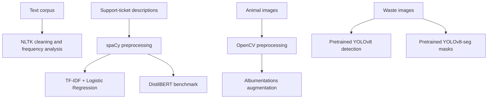

# Applied NLP and Computer Vision Portfolio

A collection of practical experiments in text analysis, support-ticket classification, image preprocessing, and object detection/segmentation. The repository brings together related coursework implementations as separate, reproducible workstreams; it does not present them as one deployed product.

## Projects at a glance

| Workstream | Problem | Methods and tools | Reported evidence |
|---|---|---|---|
| Movie-review corpus analysis | Explore positive and negative review language before modeling | **NLTK**, Unicode normalization, regular expressions, stop-word filtering, frequency analysis | 2,000 reviews (1,000 per sentiment class) and 1,583,820 raw tokens |
| IT support-ticket triage | Route free-text incident descriptions to an operational category | **spaCy**, TF-IDF, Logistic Regression; benchmarked against **DistilBERT** | Logistic Regression: 84.03% accuracy / 84.20% F1; DistilBERT: 84.70% accuracy / 84.74% F1 |
| Image-preparation pipelines | Improve and augment animal images for downstream object-recognition experiments | **OpenCV**, RGB/HSV inspection, contrast enhancement, bilateral filtering, **Albumentations** | Two preprocessing approaches compared on a 20-image sample |
| Waste detection and instance segmentation | Compare pretrained object-detection and segmentation inference on waste images | **YOLOv8**, **YOLOv8-seg**, **OpenCV**, PyTorch | Report compared predicted counts on a small image subset; count correlation 0.75 and mean absolute count difference 0.40 at confidence 0.35 |

## Workflow illustrations



## Core competencies

- **Natural Language Processing:** corpus exploration, normalization, token filtering, stop words, sentiment-oriented text analysis, TF-IDF, supervised text classification, and category-level model evaluation.
- **Classical and Transformer models:** Logistic Regression baseline and comparative evaluation with DistilBERT for support-ticket text.
- **Computer Vision:** image loading, color-space inspection, contrast/denoising, data augmentation, object detection, and instance segmentation.
- **Model evaluation:** accuracy, precision, recall, F1, confusion matrices, and comparison of detection/segmentation counts. The reported count correlation is not an accuracy or mAP score.
- **Responsible data handling:** small-sample limitations, dataset provenance, and keeping private datasets and credentials out of source control.

## Technologies

**Python**, **NLTK**, **spaCy**, **scikit-learn**, **Hugging Face Transformers**, **Hugging Face Datasets**, **OpenCV**, **Albumentations**, **Ultralytics YOLO**, **PyTorch**, **Pandas**, **NumPy**, **Matplotlib**, **Seaborn**, and **Pillow**.

## Repository layout

```text
src/
  analyze_movie_reviews.py       # NLTK corpus exploration and text cleaning
  classify_support_tickets.py    # spaCy + TF-IDF + Logistic Regression baseline
  prepare_yolo_images.py         # OpenCV preprocessing and Albumentations
  benchmark_waste_yolo.py        # YOLOv8 detection vs. YOLOv8-seg inference
```

The support-ticket notebook also benchmarks DistilBERT. Its reported metrics are included above as results from the submitted experiment; the compact script in this repository focuses on the classical, CPU-friendly baseline.

## Setup

```bash
python -m pip install -r requirements.txt
python -m spacy download en_core_web_sm
```

NLTK downloads the movie-review and stop-word corpora when the corpus-analysis script runs. The other scripts use local, authorized input data and download model weights as needed.

## Running the examples

```bash
python src/analyze_movie_reviews.py
python src/classify_support_tickets.py --csv data/tickets.csv --text-column description --label-column category
python src/prepare_yolo_images.py --input-dir data/animals/images --output-dir artifacts/animals
python src/benchmark_waste_yolo.py --input-dir data/waste/images --output-csv artifacts/waste_counts.csv
```

The ticket CSV must contain a text field and a target category. Image data, annotations, and model checkpoints are not included. Use data you are authorized to process and check the dataset license before redistribution.

## Results and limitations

The ticket-classification report found a small advantage for DistilBERT over the TF-IDF Logistic Regression baseline on its evaluation split. The notebook does not establish that this difference generalizes to other ticket populations.

The waste experiment used pretrained checkpoints in inference mode, not a newly trained detector. The report and notebook describe a small sample of approximately 55–58 images; the count-correlation comparison measures agreement between predicted object counts, not correctness against ground truth. The animal preprocessing comparison also used only 20 images. These results are useful as implementation exercises, not production benchmarks.

No datasets, trained weights, API keys, access tokens, or personal information are included.
